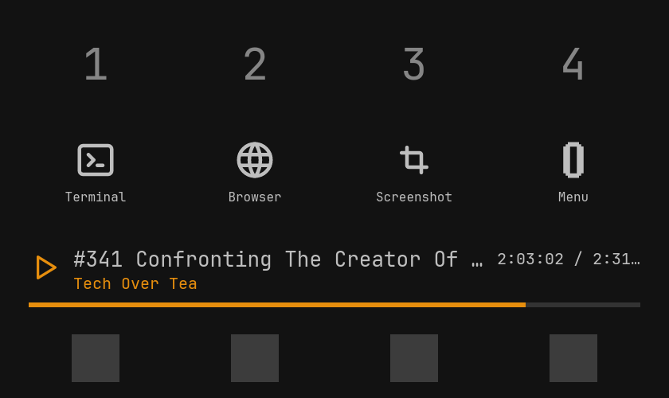
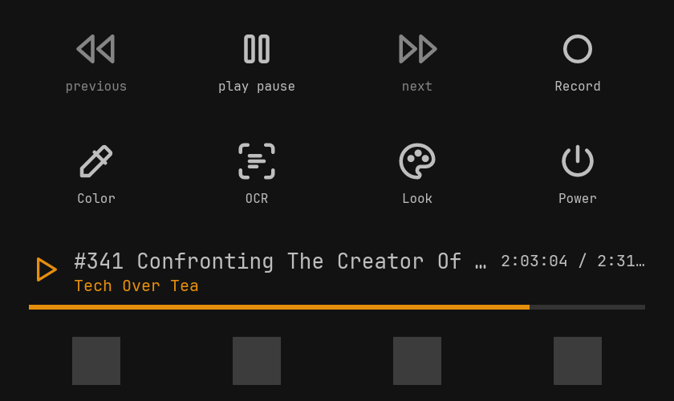
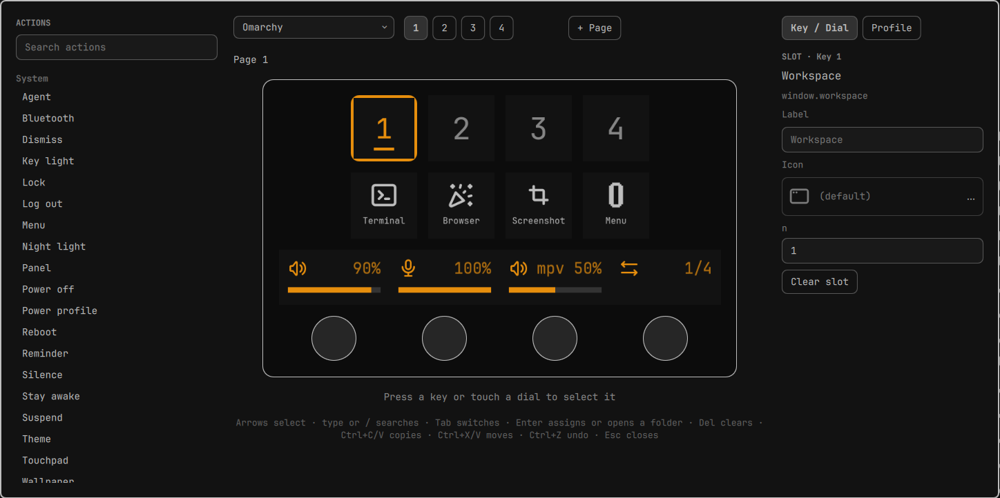
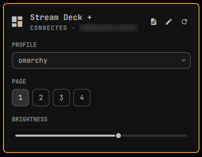

<div align="center">

# 🦆 DuckyDeck

**The Elgato Stream Deck + as a native part of [Omarchy](https://omarchy.org).**

8 keys, 4 dials and the touch strip – styled by your Omarchy theme, controlled from
the Omarchy shell, every action running through the `omarchy` CLI.

*Plug it in – it works.*

[](https://github.com/khaledchaar-cpu/duckydeck/releases/latest)





</div>

## Highlights

- 🎨 **Looks like your desktop.** Keys follow the active Omarchy theme and font, live – switch theme and the deck follows.
- 🎛️ **Dials that mean something.** Volume, mic, brightness, workspaces – and **per-app volume**: press and turn to pick a playing app, turn to set its level, press to mute it.
- 📺 **A useful touch strip.** Shows the dial levels or the playing media with progress; swipe to change pages.
- 🖱️ **Graphical editor.** Drag & drop actions onto keys and dials in a shell overlay, with icon browser (Tabler, Lucide or your own images) and a learn mode – press a key on the deck to select it.
- 🧩 **Built into the shell.** Bar icon and panel for profile, page and brightness; entry in the Omarchy menu; notifications and OSD from Omarchy itself.
- 🔁 **Smart profiles.** Pages and folders as plain TOML, reloaded on save; automatic switching by the focused window.
- ⚡ **Live keys.** Keys show state: current audio output, active player, next reminder, night light, do-not-disturb …
- 🧱 **Multi actions and toggles.** Sequences with delays, keys that alternate between two actions.
- 📜 **Your own scripts.** Drop an executable into `~/.config/duckydeck/scripts/` and it becomes a key or dial action that can update its own label, icon and level.
- 🪶 **Small and quiet.** One Rust daemon, ~14 MB RAM, events instead of polling, no network, no telemetry, no root.

## Screenshots

<p align="center">
  <br>
  <em>The editor – drag actions onto keys and dials, the deck updates as you go.</em>
</p>

<p align="center">
  <br>
  <em>The panel behind the bar icon – profile, page, brightness.</em>
</p>

Made for current Omarchy. Reference device is the Stream Deck + (USB `0fd9:0084`).

## Install

```bash
curl -LO https://github.com/khaledchaar-cpu/duckydeck/releases/latest/download/duckydeck-0.1.5-1-x86_64.pkg.tar.zst
sudo pacman -U duckydeck-0.1.5-1-x86_64.pkg.tar.zst
```

The package is unsigned, so pacman only installs it from a local file. Packages for every version are on the [releases page](https://github.com/khaledchaar-cpu/duckydeck/releases).

Then plug the deck in (or replug it). That's all: the package ships a udev rule
(access without root, starts the daemon on plug-in) and a systemd user service
for every user. On its first start the daemon runs `duckydeck setup`, which adds
the bar widget, an Omarchy menu entry and a font hook. You get a
“Stream Deck + connected” notification.

## Use

- **Editor:** *Edit layout* in the panel, *Stream Deck → Edit* in the Omarchy menu or `duckydeck edit`. Arrange keys and dials by drag & drop; every change is saved and shown on the deck immediately, Ctrl+Z undoes. Esc closes.
- **Bar icon / panel:** click the deck icon in the bar to switch profile and page,
  set the brightness or reload. Also in the Omarchy menu as *Stream Deck*.
- **Touch strip:** swipe left/right to change the page.
- **CLI:**

```
duckydeck status                 # device, profile, page, brightness
duckydeck profile <name>         # switch profile
duckydeck page <n>               # open page n
duckydeck brightness <0-100>
duckydeck check                  # validate your config without restarting
duckydeck export omarchy > ~/.config/duckydeck/profiles/mine.toml
duckydeck edit                   # open the graphical editor
duckydeck reload
```

Add `--json` for machine-readable output.

## Configure

Everything lives in `~/.config/duckydeck/` and reloads when you save. An invalid
file shows a notification with file and line; the last valid config stays active.

`config.toml` (all optional):

```toml
brightness = 60           # 0-100
screensaver_minutes = 10  # dim after inactivity, 0 = never
profile = "omarchy"       # profile when no window rule matches
```

A profile is `profiles/<name>.toml`. Start from the built-in one
(`duckydeck export omarchy`), see [examples/profiles/omarchy.toml](examples/profiles/omarchy.toml):

```toml
name = "Coding"
match = { class = "^(Alacritty|kitty|com.mitchellh.ghostty)$" }   # optional, regex

[[pages]]
keys = [
  { action = "window.workspace", args = { n = 1 } },
  { action = "launcher.terminal" },
  { action = "structure.folder", args = { folder = "power" }, label = "Power" },
  {},                                                    # empty key
]
dials = [{ action = "media.volume", args = { step = 5 } }]

[folders.power]
keys = [{ action = "system.lock" }, { action = "system.suspend" }]
```

### Automatic profile switching

A profile with `match = { class = "…", title = "…" }` becomes active while a
matching window has focus (all given regexes must match; the first profile by
file name wins). Otherwise the deck shows `profile` from `config.toml`, or the
profile you picked last in the panel or CLI.

### Actions

| Group | Actions |
|---|---|
| `system` | `lock`, `suspend`, `reboot`, `shutdown`, `logout`, `menu`, `panel`, `theme`, `wallpaper`, `nightlight`, `idle`, `dnd`, `dismiss_notifications`, `bluetooth`, `power_profile`, `touchpad`, `keyboard_backlight`, `reminder`, `agent` |
| `capture` | `screenshot`, `screenrecording`, `color_picker`, `ocr`, `qr` |
| `launcher` | `terminal`, `browser`, `files`, `app` (`app = "<desktop-entry id>"`, e.g. `"omacalc"`) |
| `window` | `workspace`, `move_to_workspace`, `close`, `float`, `fullscreen`, `tiled_fullscreen`, `pseudo`, `split`, `pop`, `focus`, `move`, `scratchpad`, `transparency`, `gaps`, `layout`, `to_monitor`, `monitor_internal`, `monitor_mirror`, `dispatch` |
| `media` | `play_pause`, `next`, `previous`, `output_switch`, `source_switch` (keys); `volume`, `mic`, `app_volume` (dials) |
| `display` | `brightness` (dial) |
| `window` (dial) | `workspace_scroll` |
| `structure` | `folder`, `page`, `back`, `profile`, `multi`, `toggle` |
| `script` | your own scripts, see below |

Arguments of each action are documented in [actions/catalog.toml](actions/catalog.toml).
`system.reboot`, `system.shutdown` and `system.logout` need a long press.

Multi and toggle keys wrap other actions:

```toml
# Runs the steps in order.
{ action = "structure.multi", label = "Focus", args = { steps = [
    { action = "system.dnd" },
    { delay_ms = 300 },
    { action = "window.workspace", args = { n = 3 } },
] } }

# Alternates between two actions; the key shows what the next press does.
{ action = "structure.toggle", args = { states = [
    { action = "structure.profile", args = { profile = "coding" }, label = "Coding" },
    { action = "structure.profile", args = { profile = "omarchy" }, label = "Default" },
] } }
```

### Script actions

Every executable file in `~/.config/duckydeck/scripts/` becomes an action `script.<file name>` – in the editor under *Scripts*. Setup puts a commented `hello` example there to start from; more in `/usr/share/doc/duckydeck/examples/scripts/`.

```sh
#!/bin/sh
# duckydeck-label: Hello
# duckydeck-icon: script
read -r event                       # {"event":"press","args":{}}
case "$event" in
  *'"press"'*) echo "{\"label\":\"$(date +%H:%M)\"}" ;;   # updates the key
esac
```

- The deck sends one JSON line per event on stdin: `init`, `press`, `long_press`, and `twist` with `delta` on dials.
- Each JSON line on stdout updates the key: `label`, `icon`, `state` (highlight), `value` (dial level 0–100); `null` resets a field.
- Header lines: `# duckydeck-slot: dial` for dials, `# duckydeck-persistent: true` to keep one process running that gets every event and can update the key whenever it likes.

## Disable or remove

```bash
systemctl --user mask --now duckydeck   # stop for good (disable has no effect, it is enabled globally)
duckydeck setup --remove                # remove bar widget, editor, menu entry and hook
omarchy pkg drop duckydeck
```

Run `setup --remove` while the shell is running: it takes the widget out of the
bar layout via `omarchy plugin disable`.

## Develop

```bash
systemctl --user stop duckydeck
cargo run -p duckydeckd -- --debug
DUCKYDECK_FAKE_DEVICE=1 cargo run -p duckydeckd   # no device: renders to $XDG_RUNTIME_DIR/duckydeck/fake/deck.png
scripts/check.sh                                  # fmt + clippy + tests
```

Package: [packaging/PKGBUILD](packaging/PKGBUILD). Specification: [SPEC.md](SPEC.md) (German).

## License

MIT. Icons: [Tabler Icons](https://tabler.io/icons) (MIT).
